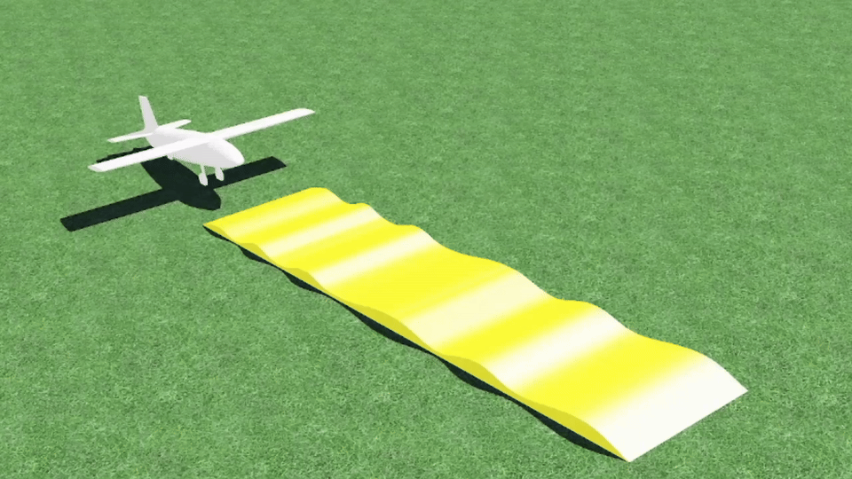
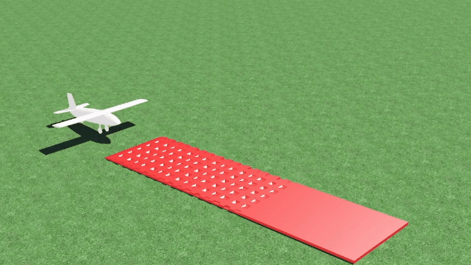
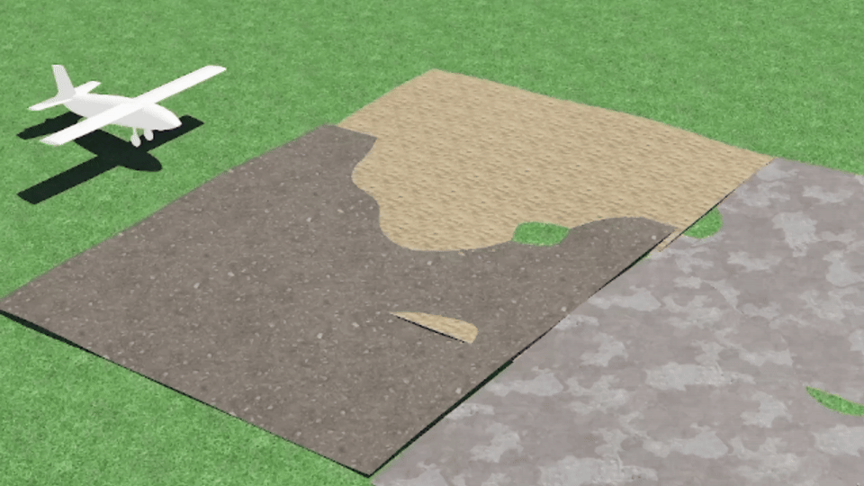
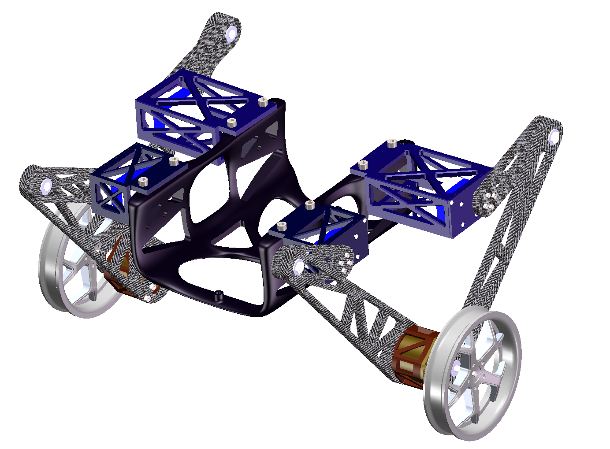
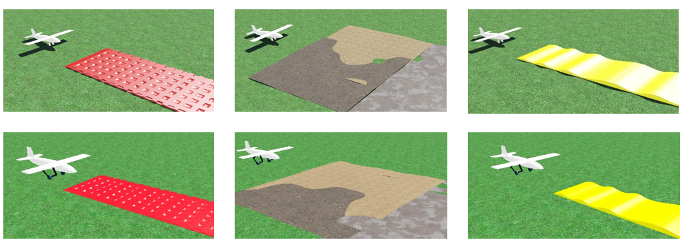
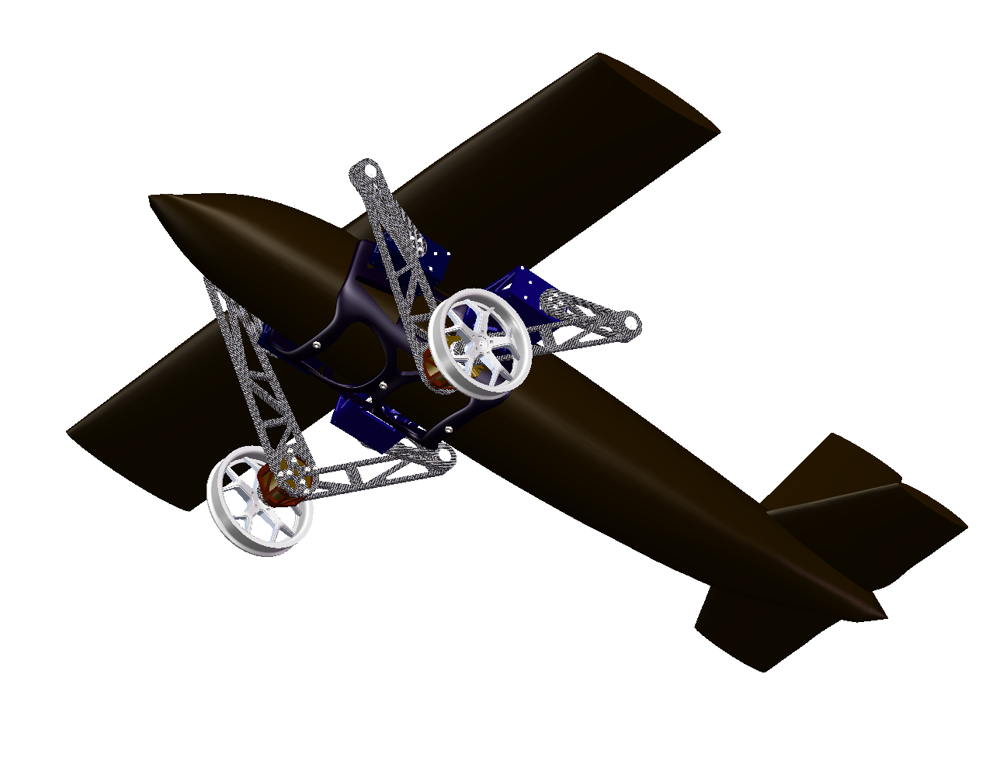

# fix-wing-UAV-with-wheel-leg
[ICUAS2026]wheel-leg of fix-wing UAV
# Fixwing-wheelLeg

Paper Title:Topology-Optimized Wheel-Leg Structure for Fixed-Wing UAV Multi-Terrain Taxiing Systems

The paper is Accepted in ICAUS2026!

Please visit our project website [Fixwing-wheelLeg](https://github.com/ayan1991/fix-wing-UAV-with-wheel-leg.git/).
If you find this work useful or interesting, please kindly give us a star ⭐, thanks! 😀

<p align="center">
    |  |  |  |
    |---|---|---|
    |  |  |  |
    
     
     
</p>

## Quick Start
Compiling tests passed on ubuntu **18.04, and 20.04** with ros installed.
You can just execute the following commands one by one.
### Dependence:


`

Then install PyTorch for your platform:

```bash
# NVIDIA GPU (CUDA 12.6 as an example)
uv pip install torch --index-url https://download.pytorch.org/whl/cu126

# CPU only (Linux/Windows)
uv pip install torch --index-url https://download.pytorch.org/whl/cpu

# Apple Silicon (Metal/MPS)
uv pip install torch
```

Run an example:
```bash
uv run examples/rigid/single_franka.py
```


## Update
26-09-16
1. Fixed the bug reported in [Issue 16](https://github.com/ayan1991/UMMC-TiltRotor/issues/16). Thanks to JMang0321 for the report!


26-09-16
1. Creat this repository by AIC-ZJU-Lab

## Citing
The method used in this software are described in the following paper (available on )
```
@ARTICLE{zhang2026Fixwing-wheelLeg,
  author={Zan Zhou,Yanhui Zhang,Yiming Dai, Ziping Zhao, Weifang Chen},
  journal={ICAUS2026}, 
  title={Topology-Optimized Wheel-Leg Structure for Fixed-Wing UAV Multi-Terrain Taxiing Systems}, 
  year={2026},
  volume={22},
  number={},
  pages={},
  }
```
